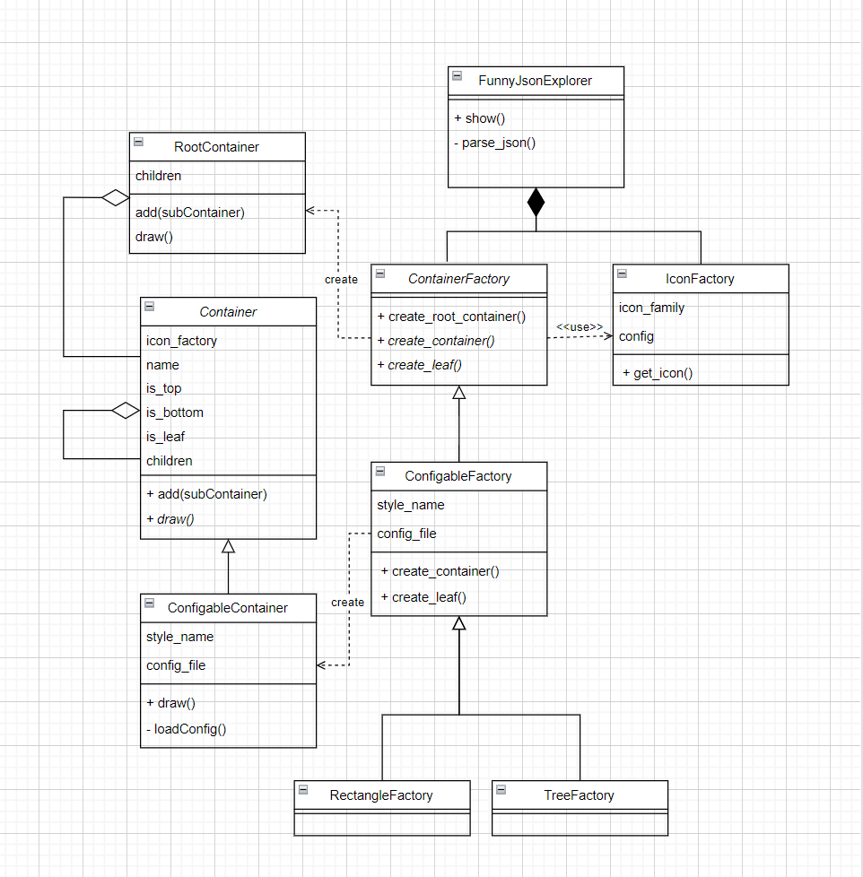

# Funny JSON Explorer

一个用Python实现的JSON文件可视化的命令行界面小工具 :)

是中山大学计算机学院软件工程课的小作业(恼)

# 使用方法

在项目根目录打开终端,输入以下命令

```shell
./fje -f <json file> -s <style> -i <icon family>
```

Windows与Linux都是这样用哦!

# 功能介绍

FJE可以快速切换**风格**（style），包括：树形（tree）、矩形（rectangle）；

```shell
$ ./fje -f example.json -s tree
 ├─ oranges
 │  └─ mandarin
 │     ├─ clementine
 │     └─ tangerine: cheap & juicy!
 └─ apples
    ├─ gala
    └─ pink lady

$ ./fje -f example.json -s rectangle
 ┌─ oranges────────────────────────────┐
 │  ├─ mandarin────────────────────────┤
 │  │  ├─ clementine───────────────────┤
 │  │  ├─ tangerine: cheap & juicy!────┤
 ├─ apples─────────────────────────────┤
 │  ├─ gala────────────────────────────┤
 └──┴─ pink lady───────────────────────┘
```

也可以指定**图标族**（icon family），为中间节点或叶节点指定一套icon

```shell
$ ./fje -f example.json -i chess
 ├─♜oranges
 │  └─♜mandarin
 │     ├─♟clementine
 │     └─♟tangerine: cheap & juicy!
 └─♜apples
    ├─♟gala
    └─♟pink lady

$ ./fje -f example.json -i emoji
 ├─🤔oranges
 │  └─🤔mandarin
 │     ├─🥵clementine
 │     └─🥵tangerine: cheap & juicy!
 └─🤔apples
    ├─🥵gala
    └─🥵pink lady    
```

# 可扩展性

## 图标族

仅需编辑`config/icon_config.json`就能定义自己的图标族哦!

打开这个文件你就一定懂怎么添加了:)

## 风格

参考以下步骤

+ 在`container.py`中实现自己的`container.draw()`
+ 在`container_factory.py`中实现自己的`containerFactory`
+ 在main中申明使用containerFactory

亦或亦可从config新建自己的风格!

+ 编辑`style_config.json`,新增自己的风格模板
+ 在container_factory.py中新增继承自ConfigableFactory的factory
+ 在main中申明使用containerFactory

style_config.json中一个风格构造如下:
+ top/body/bottom 分别对应于第一行/中间行/最后一行
+ start/follow 分别对应于第一位与后面位置的前缀填充
+ opening/lasting 该级目录是否是最后一个分支时对应的前缀填充
+ open/last 当前项目是否是上一级目录的最后一个分支,分别对应的前缀填充
+ padding/end 后缀填充

# 设计文档



+ FunnyJsonExplorer是程序的入口,解析json文件,并传递给ContainerFactory是否头行,是否尾行,是否叶节点等关键绘制信息
+ IconFactory读取配置文件中不同的图标族
+ RootContainer只是递归绘制Container的入口,本身不会绘制内容
+ 每个Container类负责绘制它所属的那一行内容
  + ConfigableContainer类实现了由config.json读取style配置进行绘制的方法
+ ContainerFactory类负责创建Container对象,并且将IconFactory生成的Icon传递给Container
  + ConfigableFactory是ConfigableContainer专属的抽象工厂
    + RectangleFactory与TreeFactory是定义好初始化参数的ConfigableFactory,分别定向去配置Rectangle与Tree风格
  
draw()方法递归传递的prefix不是字符串,而是不同级目录"是否是最后一个项目"的01表,每个container由此计算它所在行的前缀
