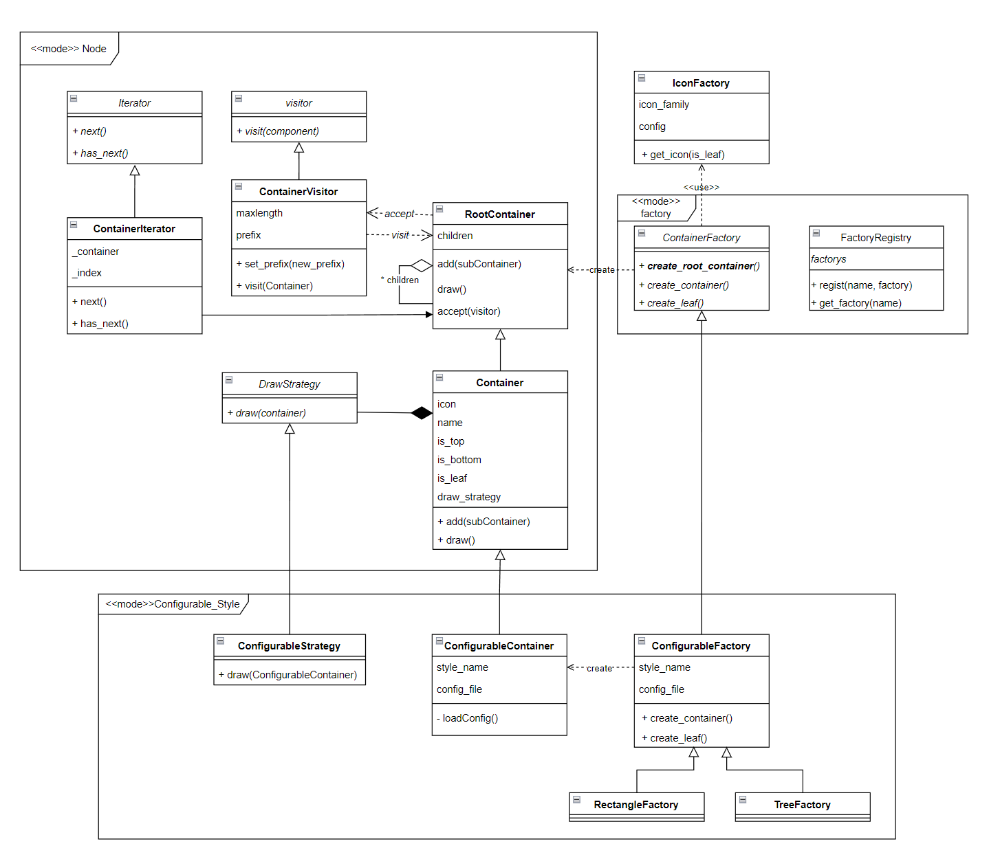

# Funny JSON Explorer

一个用Python实现的JSON文件可视化的命令行界面小工具 :)

是中山大学计算机学院软件工程课的小作业(恼)

# 使用方法

在项目根目录打开终端,输入以下命令

```shell
./fje -f <json file> -s <style> -i <icon family>
```

或者

```shell
python3 fje.py -f <json file> -s <style> -i <icon family>
```

# 功能介绍

FJE可以快速切换**风格**（style），包括：树形（tree）、矩形（rectangle）；

```shell
$ ./fje -f example.json -s tree
 ├─ oranges
 │  └─ mandarin
 │     ├─ clementine
 │     └─ tangerine: cheap & juicy!
 └─ apples
    ├─ gala
    └─ pink lady

$ ./fje -f example.json -s rectangle
 ┌─ oranges────────────────────────────┐
 │  ├─ mandarin────────────────────────┤
 │  │  ├─ clementine───────────────────┤
 │  │  ├─ tangerine: cheap & juicy!────┤
 ├─ apples─────────────────────────────┤
 │  ├─ gala────────────────────────────┤
 └──┴─ pink lady───────────────────────┘
```

也可以指定**图标族**（icon family），为中间节点或叶节点指定一套icon

```shell
$ ./fje -f example.json -i chess
 ├─♜oranges
 │  └─♜mandarin
 │     ├─♟clementine
 │     └─♟tangerine: cheap & juicy!
 └─♜apples
    ├─♟gala
    └─♟pink lady

$ ./fje -f example.json -i emoji
 ├─🤔oranges
 │  └─🤔mandarin
 │     ├─🥵clementine
 │     └─🥵tangerine: cheap & juicy!
 └─🤔apples
    ├─🥵gala
    └─🥵pink lady  
```

# 设计文档



+ 框架
  + 工厂模式factory创建container对象
  + 访问者模式visitor定义了访问container要执行的行为
  + 策略模式DrawStrategy定义了draw()的具体行为
  + 迭代器Iterator定义了container访问子节点的方式
+ 新增图标族
  + 直接配置`config/icon_config.json`即可!
+ 新增风格
  + 可以基于ConfigurableStyle框架,编辑`config/style_config.json`后再新增自己的工厂方法
  + 也可重写Strategy\Container\Factory三个部分
